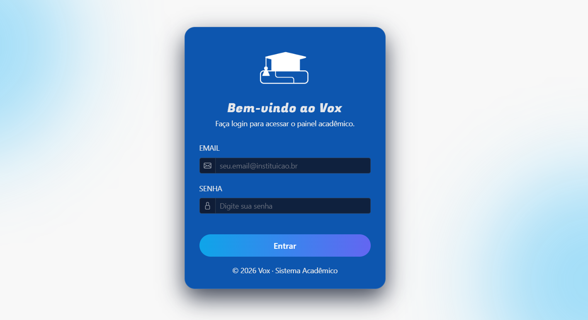

# Vox

## Descrição do Projeto
O **Vox** é uma aplicação desenvolvida em Java com o framework Spring Boot. O objetivo do projeto é gerenciar processos administrativos e acadêmicos, incluindo reuniões, processos, usuários e assuntos relacionados a colegiados e coordenadores.

## Tecnologias Utilizadas
<div>
  
  
  
  
  
</div>

## Estrutura do Projeto
O projeto segue uma arquitetura MVC (Model-View-Controller) e está organizado da seguinte forma:

- **src/main/java**: Contém o código-fonte principal da aplicação.
  - `controller`: Controladores responsáveis por gerenciar as requisições HTTP.
  - `entity`: Entidades que representam os modelos de dados.
  - `repository`: Interfaces para acesso ao banco de dados.
  - `service`: Classes de serviço que implementam a lógica de negócios.
  - `validation`: Classes para validação de dados.
- **src/main/resources**: Contém os recursos estáticos e templates da aplicação.
  - `templates`: Arquivos HTML organizados em subpastas para diferentes funcionalidades.
  - `static`: Arquivos estáticos como CSS, JavaScript e imagens.
  - `application.properties`: Configurações da aplicação.

## Funcionalidades
- Gerenciamento de usuários (admin, coordenadores, professores).
- Controle de reuniões e processos administrativos.
- Interface web com templates organizados por funcionalidade.
- Integração com banco de dados para persistência de dados.

## Como Executar o Projeto
1. Certifique-se de ter o Java 21 instalado.
2. Clone este repositório:
   ```bash
   git clone <URL_DO_REPOSITORIO>
   ```
3. Navegue até o diretório do projeto:
   ```bash
   cd Vox
   ```
4. Execute o comando para iniciar a aplicação:
   ```bash
   ./mvnw spring-boot:run
   ```
   Ou, no Windows:
   ```bash
   mvnw.cmd spring-boot:run
   ```
5. Acesse a aplicação no navegador em: `http://localhost:8080`

## Estrutura de Templates
Os templates HTML estão organizados da seguinte forma:
- **auth**: Páginas de autenticação (ex.: login).
- **admin**: Páginas administrativas para gerenciar assuntos, colegiados e usuários.
- **processos**: Páginas para gerenciar processos administrativos.
- **reunioes**: Páginas para gerenciar reuniões de coordenadores e professores.
- **fragments**: Fragmentos reutilizáveis como cabeçalhos e barras de navegação.

## Contribuição
Contribuições são bem-vindas! Sinta-se à vontade para abrir issues e enviar pull requests.

## Licença
Este projeto está licenciado sob a licença MIT. Veja o arquivo LICENSE para mais detalhes.

**Contribuição**
<table>
  <tr>
   <td align="center">
      <a href="https://github.com/jessyekessia" title="gitHub">
        <br>
        <sub>
          <b>Jessye Késsia Pereira</b>
        </sub>
      </a>
    </td>
    <td align="center">
      <a href="https://github.com/Maira-larissa" title="gitHub">
        <br>
        <sub>
          <b>Maira Larissa</b>
        </sub>
      </a>
    </td>
     <td align="center">
      <a href="https://github.com/iamjonn" title="gitHub">
        <br>
        <sub>
          <b>Jonata Nascimento</b>
        </sub>
      </a>
    </td>
      </a>
    </td>
  </tr>
</table>


